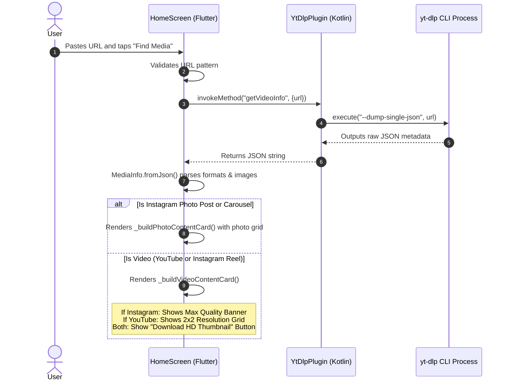
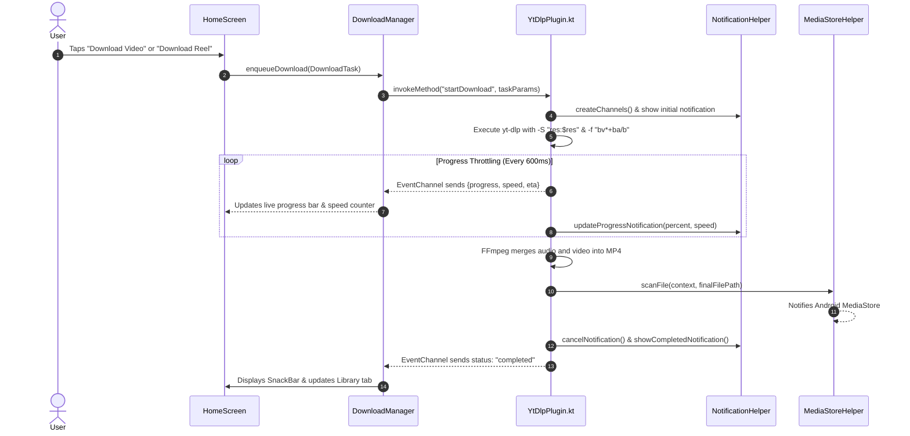
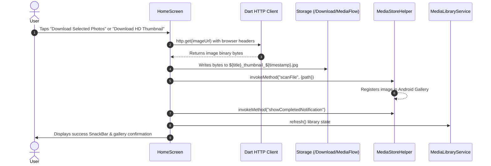

# MediaFlow (v1.5.3) — Complete Architecture, Features & Workflow Specification

> [!NOTE]
> This document provides an exhaustive, crystal-clear breakdown of **MediaFlow's internal architecture, end-to-end workflows, input-to-output matrix, and component responsibilities**. It serves as the ultimate blueprint of how every module functions under the hood.

---

## 1. Core Architecture Philosophy

MediaFlow is built as a **100% On-Device, Native Hybrid Application**:
* **No Remote Transcoding Servers**: All video extraction, audio conversion, and stream multiplexing happens directly on the user's Android hardware.
* **Native Media Engines**: Powered by [`youtubedl-android`](file:///c:/Users/91809/OneDrive/Desktop/Projects/Y%20downloader/mobile/android/app/build.gradle.kts) embedding a standalone Python runtime, updated **yt-dlp (2026.08.19)**, **FFmpeg (8.0.1)**, and **Aria2c**.
* **Precision Light Monochrome UI (Stitch System)**: A high-contrast, modern UI featuring `#F8FAFC` slate backgrounds, `#090D16` obsidian typography, and `#E11D48` brand accents.

---

## 2. "Kya Hai Aur Kya Nahi" (What Exists vs What Doesn't)

### ✅ What MediaFlow HAS ("Kya Kya Hai"):
1. **Raw Resolution Engine**: Direct extraction of true 4K (2160p), 2K (1440p), 1080p60, 720p, and SD streams without forced codec downscaling.
2. **Instagram Smart Bifurcation**:
   * **Reels / Videos**: Streamlined 1-tap download at Maximum Available Quality with combined audio (no artificial resolution grids).
   * **Photo Posts & Multi-Photo Carousels**: Interactive grid showing all photos, checkboxes, *Select All / Deselect All*, and batch JPG downloads.
3. **HD Thumbnail / Cover Image Extraction**: Dedicated 1-tap button to download the original high-resolution cover image for **any** video (YouTube & Instagram).
4. **Android MediaStore Gallery Integration**: Every downloaded video, audio track, photo, and thumbnail is immediately indexed so it appears instantly in the phone's native Gallery / Google Photos.
5. **Real-Time System Notification Tray**: Foreground notification channel displaying live percentage, transfer speed (e.g. `4.2 MB/s`), dynamic progress bar, and a quick **Cancel** action.
6. **In-App Media Suite**:
   * **Video Player**: ExoPlayer-backed player with auto-orientation (portrait lock for vertical shorts/reels, landscape for horizontal videos), brightness/volume swipe gestures, double-tap seek, and PiP.
   * **Photo Viewer**: Multi-touch pinch-to-zoom interactive viewer.
   * **Audio Player**: Background audio service with playback speed controls.
7. **Self-Healing Library**: The Library tab automatically syncs with disk storage. If you delete a file from your phone's Gallery, it is automatically removed from the app library on the next visit.

### ❌ What MediaFlow DOES NOT HAVE ("Kya Kya Nahi Hai"):
1. **No External Server Transcoding**: Videos are never uploaded to a 3rd party backend to be encoded.
2. **No Video Watermarks**: All media is saved in its 100% pristine original source format.
3. **No Account Credential Harvesting**: Does not force user logins or require Instagram/YouTube credentials to download public content.
4. **No Artificial Artificial Downscaling**: Does not force low-res H.264 when higher-resolution 4K/2K streams are available.
5. **No Forced Resolution Grids on Instagram**: Instagram videos only possess one high-quality master stream; MediaFlow does not invent fake 720p/480p options for Instagram.

---

## 3. Component Responsibilities ("Kiska Kya Kaam Hai")

```mermaid
flowchart TD
    UI[Flutter Frontend UI\nhome_screen.dart] --> DM[DownloadManager\ndownload_manager.dart]
    UI --> MLS[MediaLibraryService\nmedia_library_service.dart]
    DM --> YTS[YtDlpService\nytdlp_service.dart]
    YTS -->|MethodChannel| KOT[YtDlpPlugin.kt\nNative Android Engine]
    KOT --> YTDLP[Embedded yt-dlp & FFmpeg]
    KOT --> NH[NotificationHelper.kt\nSystem Drawer Progress]
    KOT --> MSH[MediaStoreHelper.kt\nGallery Indexer]
    MSH --> PUBLIC_STORAGE[/storage/emulated/0/Download/MediaFlow]
```

### Module Breakdown:

| Module / File | Platform | Primary Responsibility ("Iska Kaam Kya Hai") |
| :--- | :--- | :--- |
| [`lib/screens/home_screen.dart`](file:///c:/Users/91809/OneDrive/Desktop/Projects/Y%20downloader/mobile/lib/screens/home_screen.dart) | Flutter / Dart | **Input & UI State Machine**: Reads clipboard, parses pasted URLs, calls metadata analyzer, displays platform badges, renders the photo selector grid or video resolution cards, and triggers downloads. |
| [`lib/services/download_manager.dart`](file:///c:/Users/91809/OneDrive/Desktop/Projects/Y%20downloader/mobile/lib/services/download_manager.dart) | Flutter / Dart | **Queue & State Orchestrator**: Maintains active tasks, queued tasks, and failed tasks. Listens to native event streams and handles task states (`queued` -> `initializing` -> `downloading` -> `merging` -> `completed`). |
| [`lib/services/media_library_service.dart`](file:///c:/Users/91809/OneDrive/Desktop/Projects/Y%20downloader/mobile/lib/services/media_library_service.dart) | Flutter / Dart | **Storage Auditor**: Scans `/storage/emulated/0/Download/MediaFlow`, parses metadata, and purges references to any files deleted externally from the phone gallery. |
| [`android/.../YtDlpPlugin.kt`](file:///c:/Users/91809/OneDrive/Desktop/Projects/Y%20downloader/mobile/android/app/src/main/kotlin/com/mediaflow/app/YtDlpPlugin.kt) | Kotlin / Native | **Native Execution Bridge**: Launches yt-dlp processes, parses CLI output lines, calculates live download speed & percentage, handles cancellation, and invokes FFmpeg for DASH stream multiplexing. |
| [`android/.../NotificationHelper.kt`](file:///c:/Users/91809/OneDrive/Desktop/Projects/Y%20downloader/mobile/android/app/src/main/kotlin/com/mediaflow/app/NotificationHelper.kt) | Kotlin / Native | **System Notifications**: Creates `mediaflow_download_progress` channel, posts live progress bar with percentage and speed to the Android pull-down drawer, and raises completion alerts. |
| [`android/.../MediaStoreHelper.kt`](file:///c:/Users/91809/OneDrive/Desktop/Projects/Y%20downloader/mobile/android/app/src/main/kotlin/com/mediaflow/app/MediaStoreHelper.kt) | Kotlin / Native | **Gallery Synchronization**: Invokes Android's `MediaScannerConnection` so new MP4s, MP3s, and JPGs immediately register in the system media database without needing a phone reboot. |
| [`lib/screens/player_screen.dart`](file:///c:/Users/91809/OneDrive/Desktop/Projects/Y%20downloader/mobile/lib/screens/player_screen.dart) | Flutter / Dart | **Smart In-App Player**: Plays downloaded MP4s. Automatically senses aspect ratios: locks vertical videos in portrait mode and horizontal videos in landscape mode. |

---

## 4. Input-to-Output Flow Matrix ("Konse Input Ke Liye Konsa Output Hai")

The table below outlines exactly what happens when you feed different links into MediaFlow:

| User Input Link | Detected Type | UI Presentation | User Options | Engine Options Passed | Final Output File | Destination & Registration |
| :--- | :--- | :--- | :--- | :--- | :--- | :--- |
| **YouTube 4K Video**<br>`youtube.com/watch?v=...` | YouTube Video | Video Preview + Duration + Creator | **4K Ultra HD**, **2K 1440p**, **1080p**, **720p**, **Audio MP3** + **Download HD Thumbnail** | `-S "res:2160"`<br>`-f "bv*+ba/b"`<br>`--merge-output-format mp4` | `Title [id].mp4`<br>*(3840x2160 VP9/AV1 + Opus/AAC merged)* | `/storage/emulated/0/Download/MediaFlow`<br>Registered in Gallery |
| **YouTube Shorts**<br>`youtube.com/shorts/...` | YouTube Short | Vertical Video Card | **1080p Full HD**, **720p**, **480p** + **Download HD Thumbnail** | `-S "res:1080"`<br>`-f "bv*+ba/b"`<br>`--merge-output-format mp4` | `Short_Title [id].mp4`<br>*(1080x1920 MP4)* | `/storage/emulated/0/Download/MediaFlow`<br>Plays vertically in player |
| **YouTube Music / MP3 Tab** | YouTube Audio | Audio Tab Active | **MP3 320 kbps (HQ)**, **MP3 192 kbps**, **M4A / AAC**, **MP3 128 kbps** | `-f "ba/b" -x`<br>`--audio-format mp3`<br>`--audio-quality 0` | `Song_Title [id].mp3`<br>*(High Bitrate MP3)* | `/storage/emulated/0/Download/MediaFlow`<br>Indexed under Audio in Library |
| **Instagram Reel / Video**<br>`instagram.com/reel/...` | Instagram Reel | **"Original Stream • Maximum Quality"** Banner *(No 2x2 grid)* | **Download Reel (Max Quality MP4)** + **Download HD Thumbnail** | `-S "res,fps"`<br>`-f "bv*+ba/b"`<br>`--merge-output-format mp4` | `Reel_Title [id].mp4`<br>*(Direct Max Res MP4)* | `/storage/emulated/0/Download/MediaFlow`<br>Registered in Gallery |
| **Instagram Carousel Post**<br>`instagram.com/p/...` *(multi-image)* | Instagram Album | **Interactive Photo Grid** with image thumbnails & `#1, #2...` badges | **Checkbox per Photo**,<br>**Select All / Deselect All**,<br>**Download Selected (N)**,<br>**Download All (N)** | Asynchronous HTTP stream directly from high-res CDN URL | `Title_1_timestamp.jpg`<br>`Title_2_timestamp.jpg` | `/storage/emulated/0/Download/MediaFlow`<br>Registered in Gallery |
| **Instagram Single Photo**<br>`instagram.com/p/...` *(1 image)* | Instagram Photo | High-Res Single Image Preview Card | **Download Photo (Original Quality JPG)** | Asynchronous HTTP download from master image URL | `Title_timestamp.jpg` | `/storage/emulated/0/Download/MediaFlow`<br>Registered in Gallery |
| **Any Video Thumbnail** *(YouTube or Instagram)* | Video Cover | Dedicated Outline Button below Main Action | **Download HD Thumbnail / Cover Image** | Direct HTTP stream of `mediaInfo.thumbnail` | `Title_thumbnail_timestamp.jpg` | `/storage/emulated/0/Download/MediaFlow`<br>Registered in Gallery |

---

## 5. End-to-End Workflow Steps ("Kaha Kaise Chal Raha Hai")

### Workflow 1: User Pastes URL to Media Analysis



### Workflow 2: Video Download Execution Pipeline



### Workflow 3: Photo & Thumbnail Download Pipeline



---

## 6. How Storage & Gallery Work (Android 10 - 15)

1. **Storage Path Strategy**:
   * Primary Path: `/storage/emulated/0/Download/MediaFlow/`
   * Automatic Fallback: If external permissions are strictly confined by OS Scoped Storage, MediaFlow routes to `getExternalStorageDirectory()/MediaFlow`.
2. **Gallery Instant Recognition**:
   * Android does not automatically scan raw files written to disk unless explicitly notified.
   * MediaFlow calls `MediaStoreHelper.scanFile()` on every finished file, triggering Android's internal `MediaScannerConnection`.
   * Result: Photos and videos appear in your **Gallery**, **Google Photos**, and **WhatsApp media pickers** immediately.
3. **External Deletion Sync**:
   * If a user deletes an MP4 or JPG using their phone's built-in file manager or gallery, MediaFlow detects this on the next library launch via `_purgeDeletedFiles()` and automatically cleans up its internal database.

---

## 7. Version Verification Checklist (For Clean Installs)

To verify that your installation is running **MediaFlow v1.5.3**:
* **Splash Screen**: Look at the bottom footer text — it must state **`v1.5.3 • 100% On-Device`**.
* **Settings Tab**: Look at the version tag next to the MediaFlow logo — it must state **`v1.5.3`**.
* **Instagram Video Check**: Paste any reel URL — no 2x2 grid should appear; only the **"Original Stream • Maximum Quality"** card and **"Download Reel (Max Quality MP4)"** button will show.
* **Thumbnail Button Check**: Paste any video link — look for the **"Download HD Thumbnail / Cover Image"** button below the main download action.
