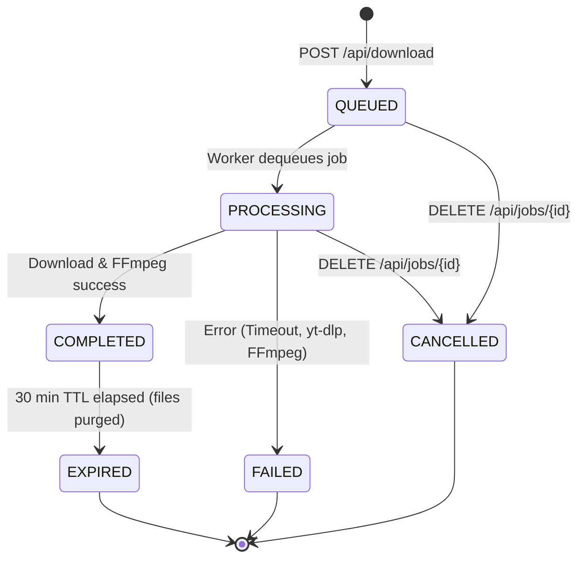

# Media Downloader Engine — Frontend API Contract

This document specifies the frozen API contract for the Media Downloader Engine backend. It serves as the definitive reference for frontend integration, defining all endpoints, data schemas, headers, error responses, SSE protocols, and state machine lifecycles.

---

## 1. Core Architecture & Session Model

### Base URL
- **Local Development**: `http://127.0.0.1:8000`
- **Production**: Configured via reverse proxy / environment.

### Session Identification
All user activities (analysis, job queuing, file retrieval) are scoped to a lightweight, cookie/header-based session:
- **Header**: `X-Session-ID: sess_<token>`
- **Cookie**: `downloader_session=sess_<token>` (HttpOnly, SameSite=Lax)
- **Direct File Downloads**: `?session_id=sess_<token>` is supported for direct browser links (`<a href="..." download>`)

> **Note**: When a client issues a request without a session header or cookie, the backend automatically issues a new cryptographically secure session ID (`sess_...`) in a `Set-Cookie` header. Subsequent requests within that browser session automatically carry the cookie.

---

## 2. Standardized Error Response Schema

All error responses (HTTP 4xx and 5xx) adhere to a unified, predictable JSON envelope. Internal paths, stack traces, and sensitive backend details are strictly suppressed.

### Error Schema
```json
{
  "error": {
    "code": "ERROR_CODE",
    "message": "Human-readable description of what failed.",
    "details": null
  },
  "error_code": "ERROR_CODE",
  "message": "Human-readable description of what failed.",
  "detail": {
    "error_code": "ERROR_CODE",
    "message": "Human-readable description of what failed.",
    "details": null
  }
}
```

### Standardized Error Codes Reference Table

| HTTP Status | Error Code | Description | Typical Cause |
| :--- | :--- | :--- | :--- |
| `400 Bad Request` | `INVALID_URL` | Malformed URL, missing scheme, or SSRF attempt against private IP/loopback. | Non-HTTP/HTTPS URLs, `127.0.0.1`, `localhost`, link-local addresses. |
| `400 Bad Request` | `UNSUPPORTED_PLATFORM` | Domain is not in the supported platforms allowlist. | User entered a Vimeo, TikTok, or generic website URL. Currently supported: YouTube, Instagram. |
| `400 Bad Request` | `FORMAT_NOT_FOUND` | Requested `format_id` does not exist in the analyzed formats list. | Tampered or stale format selection in download request. |
| `400 Bad Request` | `JOB_NOT_READY` | Requested media file is still queued or processing. | Attempting to call `/api/jobs/{job_id}/file` before status is `COMPLETED`. |
| `400 Bad Request` | `JOB_FAILED` | Job processing failed or was cancelled. | Downloading file for a job that failed during extraction/processing. |
| `403 Forbidden` | `UNAUTHORIZED_SESSION` | Client session does not match the job's owning session. | Cross-session access or missing session cookie/header on a private job. |
| `404 Not Found` | `ANALYSIS_NOT_FOUND` | Analysis record does not exist or has expired. | Analysis ID expired (TTL 60 min) or invalid UUID provided. |
| `404 Not Found` | `JOB_NOT_FOUND` | Download job does not exist. | Job ID does not exist in database or invalid UUID provided. |
| `404 Not Found` | `FILE_NOT_FOUND` | Output media file does not exist on disk. | File was manually deleted or disk cleanup purged the directory. |
| `410 Gone` | `JOB_EXPIRED` | Download job TTL expired (default 30 min) and media was purged. | Accessing file after expiration. Analysis/download must be restarted. |
| `422 Unprocessable` | `VALIDATION_ERROR` | Request body schema validation failed. | Missing required fields, invalid types in JSON payload. |
| `422 Unprocessable` | `VIDEO_UNAVAILABLE` | Media source is deleted, private, geo-blocked, or unavailable. | YouTube video deleted or copyright-blocked. |
| `422 Unprocessable` | `AUTHENTICATION_REQUIRED`| Media requires login or age-verification cookies. | Age-restricted YouTube content or private Instagram account. |
| `429 Too Many Req` | `RATE_LIMIT_EXCEEDED` | Client exceeded maximum requests per minute limit (default 60/min). | Rapid automated requests or repeated polling. |
| `429 Too Many Req` | `CONCURRENCY_LIMIT_EXCEEDED` | Session exceeded concurrent job quota (default 2 concurrent jobs). | User trying to download >2 videos simultaneously. |
| `500 Server Error` | `INTERNAL_ERROR` | Unhandled internal exception. | Safe generic error message returned; detailed stack trace logged internally. |
| `503 Service Unavail`| `CONCURRENCY_LIMIT_EXCEEDED` | Global server processing capacity reached. | System busy; client should retry after short delay. |

---

## 3. Endpoints Specification

### 3.1 `POST /api/analyze`
Analyzes a media URL, verifies domain against allowlist, guards against SSRF, extracts available streams via yt-dlp, and persists an analysis record.

- **Request Body**:
  ```json
  {
    "url": "https://www.youtube.com/watch?v=jNQXAC9IVRw"
  }
  ```
  | Field | Type | Required | Description |
  | :--- | :--- | :--- | :--- |
  | `url` | `string` | Yes | Public media URL to analyze (min length: 4). |

- **Response `200 OK`**:
  ```json
  {
    "analysis_id": "5423c9ac-735f-46ad-acfa-99927449ffb2",
    "platform": "youtube",
    "source_url": "https://www.youtube.com/watch?v=jNQXAC9IVRw",
    "title": "Me at the zoo",
    "thumbnail": "https://i.ytimg.com/vi/jNQXAC9IVRw/sddefault.jpg",
    "duration": 19,
    "uploader": "jawed",
    "formats": [
      {
        "format_id": "18",
        "type": "video+audio",
        "container": "mp4",
        "width": 640,
        "height": 360,
        "fps": 30.0,
        "vcodec": "avc1.42001E",
        "acodec": "mp4a.40.2",
        "bitrate": 596.0,
        "has_audio": true,
        "has_video": true,
        "filesize": 1420544,
        "filesize_approx": null,
        "format_note": "360p"
      },
      {
        "format_id": "140",
        "type": "audio",
        "container": "m4a",
        "width": null,
        "height": null,
        "fps": null,
        "vcodec": null,
        "acodec": "mp4a.40.2",
        "bitrate": 129.0,
        "has_audio": true,
        "has_video": false,
        "filesize": 312320,
        "filesize_approx": null,
        "format_note": "medium audio"
      }
    ],
    "expires_at": "2026-09-15T07:08:11.123456+00:00"
  }
  ```

---

### 3.2 `POST /api/download`
Enqueues a download job for processing by the background worker.

- **Request Body**:
  ```json
  {
    "analysis_id": "5423c9ac-735f-46ad-acfa-99927449ffb2",
    "format_id": "18",
    "output_format": "mp4",
    "audio_only": false
  }
  ```
  | Field | Type | Required | Default | Description |
  | :--- | :--- | :--- | :--- | :--- |
  | `analysis_id` | `string` (UUID) | Yes | — | ID returned from `POST /api/analyze`. |
  | `format_id` | `string` | Yes | — | Selected format ID from `formats` list, or `"best"`. |
  | `output_format`| `string` | No | `"mp4"` | Desired target container: `"mp4"`, `"mp3"`, `"m4a"`, `"webm"`. |
  | `audio_only` | `boolean` | No | `false` | When `true`, extracts audio directly into MP3/M4A. |

- **Response `200 OK`**:
  ```json
  {
    "job_id": "e13ef984-1dca-4186-b3d3-6d7d74fca527",
    "status": "QUEUED",
    "message": "Download job created and enqueued successfully"
  }
  ```

---

### 3.3 `GET /api/jobs/{job_id}`
Polling fallback endpoint to fetch full job metadata, execution state, and progress.

- **Response `200 OK`**:
  ```json
  {
    "id": "e13ef984-1dca-4186-b3d3-6d7d74fca527",
    "analysis_id": "5423c9ac-735f-46ad-acfa-99927449ffb2",
    "source_url": "https://www.youtube.com/watch?v=jNQXAC9IVRw",
    "platform": "youtube",
    "title": "Me at the zoo",
    "status": "COMPLETED",
    "requested_format": "18",
    "output_format": "mp4",
    "progress": 100.0,
    "downloaded_bytes": 579055,
    "total_bytes": 579055,
    "speed": "70.3 KB/s",
    "eta": "00:00",
    "file_size": 579055,
    "error_code": null,
    "error_message": null,
    "download_url": "/api/jobs/e13ef984-1dca-4186-b3d3-6d7d74fca527/file",
    "created_at": "2026-09-15T06:08:04+00:00",
    "started_at": "2026-09-15T06:08:05+00:00",
    "completed_at": "2026-09-15T06:08:11+00:00",
    "expires_at": "2026-09-15T06:38:04+00:00"
  }
  ```

---

### 3.4 `GET /api/jobs/{job_id}/events` (Real-Time SSE)
Server-Sent Events (SSE) stream providing real-time progress, speed, ETA, and state changes.

- **Headers**:
  - `Accept: text/event-stream`
  - `X-Session-ID: sess_<token>` (or cookie)

- **Behavior & Protocol**:
  1. **Immediate Initial State**: Upon connection, the backend immediately emits a `message` event containing the current job status.
  2. **Streaming Updates**: Emits status and progress changes throttled and deduplicated.
  3. **Clean Terminal Exit**: When the job reaches a terminal state (`COMPLETED`, `FAILED`, `CANCELLED`, `EXPIRED`), the backend emits the terminal event and cleanly closes the connection. No hanging connections.
  4. **Keep-Alive Heartbeat**: Sends an SSE comment `: keepalive\n\n` every 15 seconds if no progress occurs (prevents proxy timeouts during long processing).

- **SSE Event Data Payload**:
  ```json
  {
    "job_id": "e13ef984-1dca-4186-b3d3-6d7d74fca527",
    "event": "progress",
    "status": "PROCESSING",
    "progress": 54.2,
    "downloaded_bytes": 1048576,
    "total_bytes": 1934200,
    "speed": "1.2 MB/s",
    "eta": "00:03",
    "download_url": null,
    "error_code": null,
    "error_message": null
  }
  ```

- **Terminal Event Data Payload (COMPLETED)**:
  ```json
  {
    "job_id": "e13ef984-1dca-4186-b3d3-6d7d74fca527",
    "event": "status",
    "status": "COMPLETED",
    "progress": 100.0,
    "downloaded_bytes": 579055,
    "total_bytes": 579055,
    "speed": null,
    "eta": "00:00",
    "download_url": "/api/jobs/e13ef984-1dca-4186-b3d3-6d7d74fca527/file",
    "file_size": 579055
  }
  ```

---

### 3.5 `GET /api/jobs/{job_id}/file`
Secure media streaming and download endpoint. Delivers the final merged/converted file as an attachment.

- **Headers Required**:
  - `X-Session-ID: sess_<token>` (or cookie, or `?session_id=sess_<token>`)

- **Security & Validation Rules**:
  - Only accessible if job status is `COMPLETED` (returns `400 JOB_NOT_READY` if queued/processing).
  - Verifies session matching (returns `403 UNAUTHORIZED_SESSION` if requesting with different or missing session).
  - Verifies TTL (returns `410 JOB_EXPIRED` if expired).
  - Sanitizes filename to eliminate directory traversal characters and unsafe characters.

- **Response Headers**:
  - `Content-Type`: MIME type (`video/mp4`, `audio/mpeg`, `video/webm`, etc.)
  - `Content-Disposition`: `attachment; filename="Me at the zoo.mp4"`
  - `Accept-Ranges`: `bytes`
  - `Cache-Control`: `private, no-cache, no-store, must-revalidate`

---

### 3.6 `DELETE /api/jobs/{job_id}`
Cancels an active job or purges temporary files for a completed job.

- **Headers Required**:
  - `X-Session-ID: sess_<token>` (or cookie)

- **Response `200 OK`**:
  ```json
  {
    "job_id": "e13ef984-1dca-4186-b3d3-6d7d74fca527",
    "status": "deleted"
  }
  ```

---

### 3.7 `GET /api/health`
System health check verifying database connectivity, adapter status, binary availability (yt-dlp, FFmpeg, FFprobe), and temporary storage writeability.

- **Response `200 OK`**:
  ```json
  {
    "status": "healthy",
    "api": "ok",
    "database": "ok",
    "database_adapter": "supabase",
    "ytdlp": "ok",
    "ytdlp_version": "2026.08.19",
    "ffmpeg": "ok",
    "ffprobe": "ok",
    "storage": "ok"
  }
  ```

---

## 4. Job State Machine & Lifecycle



### State Machine Rules
1. `QUEUED`: Job is waiting in worker queue. Files not yet downloaded.
2. `PROCESSING`: DownloadWorker is downloading streams via yt-dlp or post-processing via FFmpeg.
3. `COMPLETED`: Media file is ready in `output/` directory. `download_url` is available.
4. `FAILED`: An error occurred. Error details recorded in `error_code` and `error_message`. Temporary files are purged immediately.
5. `CANCELLED`: Client initiated cancellation. Active processes halted and temporary directory purged.
6. `EXPIRED`: Completed job passed its 30-minute retention TTL. Temporary media files are permanently removed by cleanup service.

---

## 5. Frontend Integration Recipes

### React + Fetch SSE Example
```typescript
function subscribeToJob(jobId: string, onProgress: (data: any) => void, onComplete: (url: string) => void, onError: (err: any) => void) {
  const eventSource = new EventSource(`/api/jobs/${jobId}/events`, {
    withCredentials: true // ensures session cookie is sent
  });

  eventSource.onmessage = (event) => {
    const data = JSON.parse(event.data);
    onProgress(data);

    if (data.status === "COMPLETED") {
      eventSource.close();
      onComplete(data.download_url);
    } else if (data.status === "FAILED" || data.status === "CANCELLED" || data.status === "EXPIRED") {
      eventSource.close();
      onError(data);
    }
  };

  eventSource.onerror = (err) => {
    console.error("SSE connection error; polling fallback can be engaged", err);
    eventSource.close();
  };

  return () => eventSource.close();
}
```

### Triggering File Download
```typescript
function downloadFile(downloadUrl: string) {
  // Browsers automatically attach the downloader_session cookie
  const anchor = document.createElement("a");
  anchor.href = downloadUrl;
  anchor.setAttribute("download", "");
  document.body.appendChild(anchor);
  anchor.click();
  anchor.remove();
}
```
